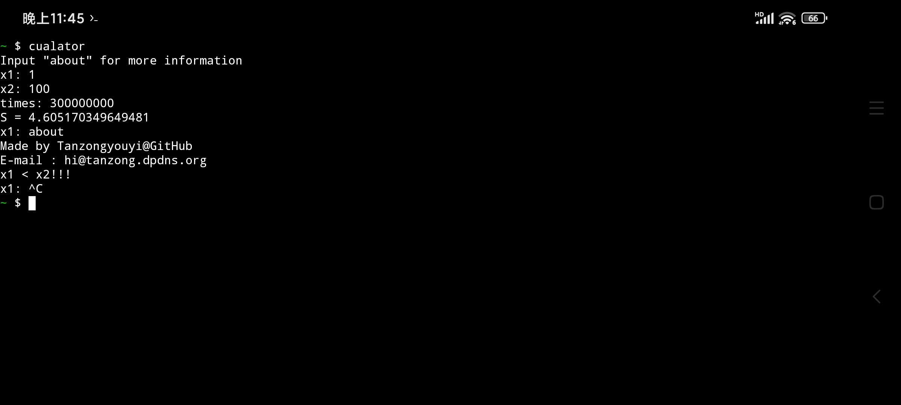

# Wave Base Tools
是由Wave Studios开发的工具包

# Cualator
cualator是一个计算变速运动位移的工具，使用微元法计算。当times=3000000时，误差仅为0.00000008

```bash
gcc cualator.c -o cualator
./cualator
```

# Dexpacker
dexpacker是一个apk加固工具，因为有未解决问题，故不提供源代码
```bash
To Do
```

# Pomodoro
pomodoro是一个命令行番茄钟，专注25分钟，休息5分钟，每4个番茄钟休息20分钟
```bash
gcc pomodoro.c -g -o pomodoro -fexec-charset=GBK
./pomodoro
windres resources.rc -o resources.o
gcc -mwindows -o pomodoro.exe pomodoro.c resources.o -lcomctl32 -fexec-charset=GBK
```
